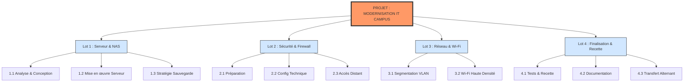

# Organigramme du Projet (WBS)


---

# Diagramme de Gantt
```mermaid
gantt
    title Planning de déploiement
    dateFormat  YYYY-MM-DD
    section Serveur/NAS
    Audit           :2026-03-02, 7d
    Config          :10d
    section Réseau/Wi-Fi
    VLANs           :2026-03-16, 7d
    Wi-Fi           :14d
    section Sécurité
    Firewall        :2026-03-09, 10


