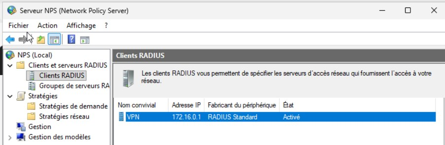
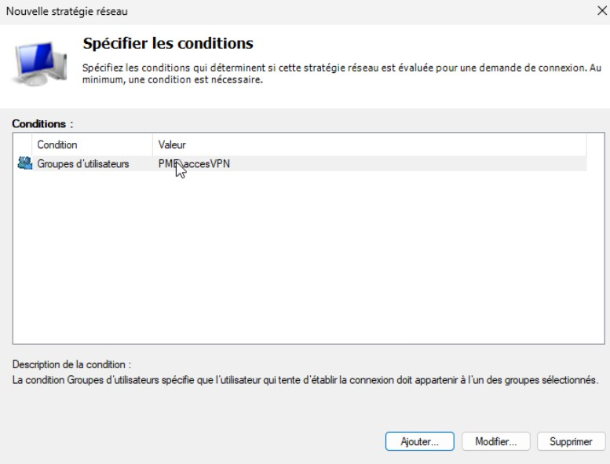
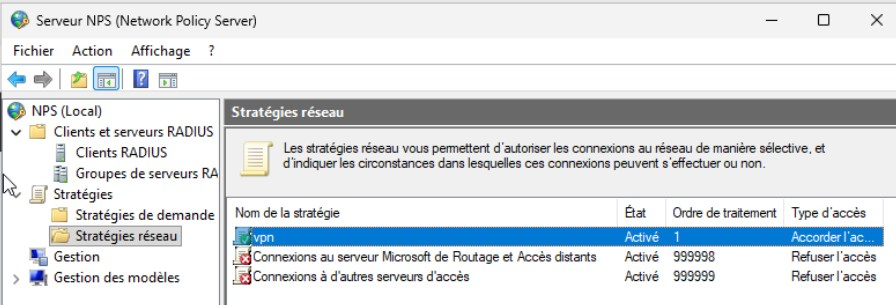
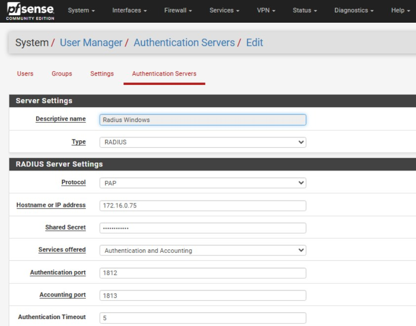
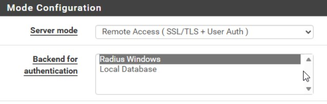
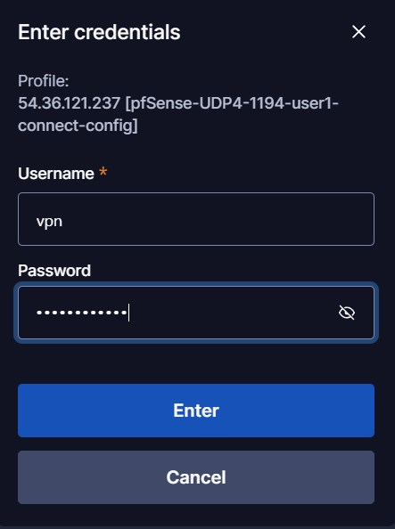
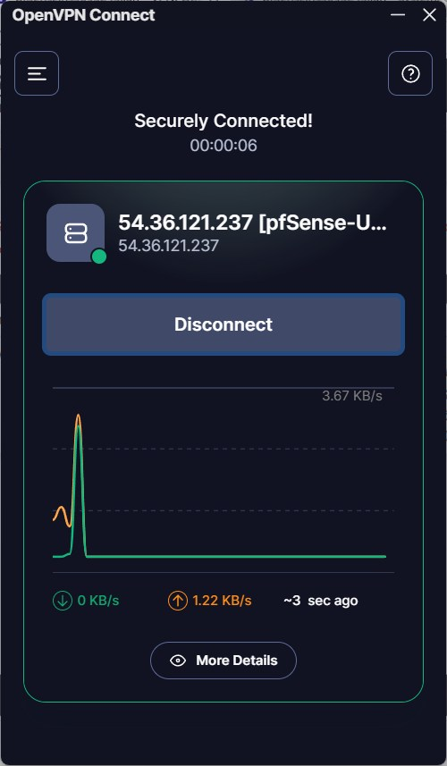

# Challenge Radius

## Contexte pro

Vous intervenez pour une PME qui veut centraliser l’authentification réseau. L’objectif est de ne plus gérer des comptes locaux sur chaque équipement et de s’appuyer sur l’Active Directory. Votre mission : mettre en place un serveur RADIUS et l’intégrer proprement à l’AD.

## Objectifs

- Monter un serveur RADIUS opérationnel sur Proxmox.  
- Lier l’authentification à l’Active Directory.  
- Tester un scénario d’accès (succès / échec) avec un compte AD.

## Indications techniques

- Le serveur RADIUS doit pouvoir interroger l’AD (LDAP ou Winbind).  
- Vérifier la connectivité réseau et les ports nécessaires.  
- Isoler les erreurs : DNS, horloge, credentials, ACL.
  
## Étape 1 — Préparer l’environnement

- Vérifier l’accès réseau entre la VM RADIUS et l’AD.  
- S’assurer que DNS et l’horloge sont corrects.

## Étape 2 — Installer le serveur RADIUS

- Déployer une VM dédiée sur Proxmox.
- Installer FreeRADIUS (ou équivalent).

## Étape 3 — Connecter RADIUS à l’Active Directory

- Configurer l’intégration AD via LDAP ou Winbind.
- Vérifier que le serveur peut interroger l’AD.

## Étape 4 — Configurer le client RADIUS

- Déclarer un client (ex: équipement réseau ou simulateur).
- Définir le secret partagé.

## Étape 5 — Tester l’authentification

- Un test valide avec un compte AD.
- Un test invalide (mauvais mot de passe ou utilisateur absent).

## Étape 6 — Documenter (bonus)
- Schéma rapide (IPs + flux).
- Récapitulatif des configs et commandes utilisées.
- Résultats des tests (succès/échec).

# Procédure : Centralisation de l'authentification réseau via RADIUS (NPS) et Active Directory

## 1. Configuration de l'annuaire (Active Directory)
* **Installation de l'Active Directory** : Déploiement du rôle AD DS et promotion du serveur en Contrôleur de Domaine.
* **Gestion des ressources VPN** :
    * Création d'un groupe de sécurité (`accesVPN`).
    * Création de l'utilisateur (`vpn`) et affectation au groupe.
    * **Autorisation Dial-in** : Activation de l'accès dans les propriétés de l'utilisateur (onglet Appel entrant).

## 2. Configuration du serveur RADIUS (Windows NPS)
* **Installation du rôle NPS** : Ajout du rôle et inscription du serveur dans l'AD.
* **Déclaration du Client RADIUS** : Enregistrement de l'IP du pfSense (ex: `172.16.0.1`) et définition du Secret Partagé.

* **Création de la Stratégie réseau** :
    * **Conditions** : Association au groupe AD `accesVPN`.
    
    * **Contraintes** : Activation du protocole d'authentification **PAP**.
    

## 3. Configuration du Pare-feu (pfSense)
* **Serveur d'authentification** : Ajout du serveur NPS dans *System > User Management*.

* **OpenVPN** : Sélection du RADIUS comme "Backend for authentication" dans les paramètres du serveur VPN.

## 4. Tests et Validation
* **Test de diagnostic** : Vérification via *Diagnostics > Authentication* sur pfSense.
* **Validation de connexion** : Test de tunnel complet et vérification des logs de sécurité Windows (ID 6272).
 
