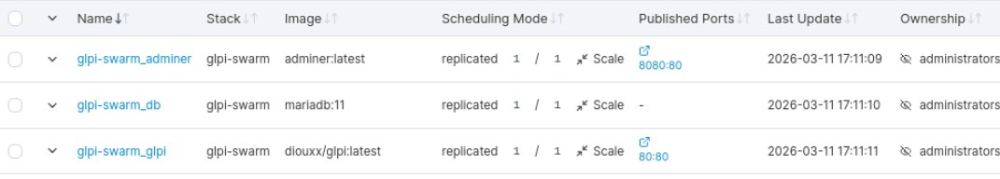
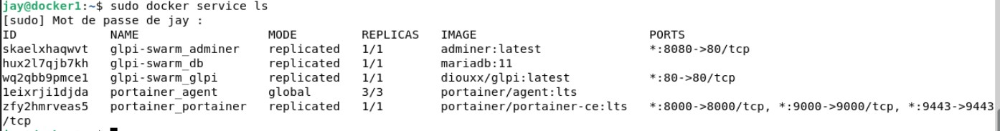
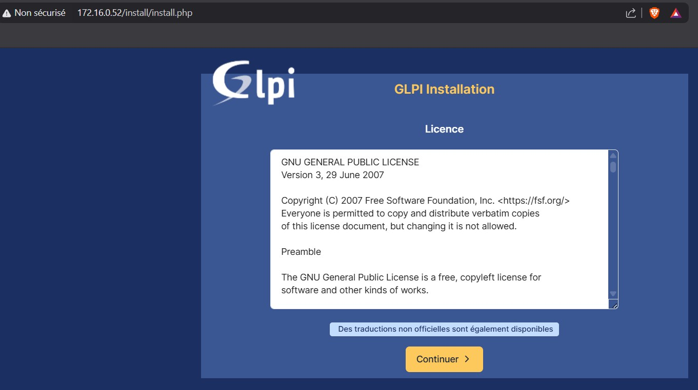
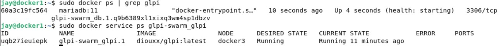
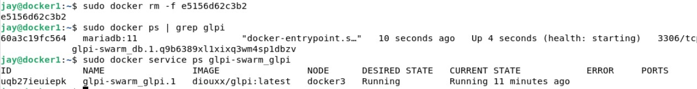

# 🐋 Challenge Docker Swarm
## Déployer GLPI sur un cluster avec Portainer

## 🗂 Contexte

Hier soir, vous avez déployé GLPI avec Docker Compose sur une seule machine. C'est bien, mais pas suffisant pour une infrastructure de production.

Votre responsable veut maintenant **haute disponibilité** : si un serveur tombe, l'application doit continuer à fonctionner. Pour ça, on va passer à **Docker Swarm** — le mode cluster intégré à Docker — et déployer GLPI en plusieurs **replicas** gérés via **Portainer**.

> 💡 **Docker Compose vs Docker Swarm**
> - Compose → un seul hôte, idéal pour le développement
> - Swarm → plusieurs hôtes, orchestration, haute disponibilité
> - La bonne nouvelle : la syntaxe reste très proche, on réutilise le `compose.yaml` que vous avez créer lors de votre challenge !

---

## 🎯 Objectifs

À la fin de cet exercice, vous aurez :

- Initialisé un cluster Docker Swarm
- Déployé une stack via l'interface Portainer
- Configuré GLPI pour tourner en **2 ou 3 replicas**
- Observé le comportement du load balancer Ingress de Swarm
- Compris pourquoi multiplier les replicas d'une BDD pose problème

---

## 📋 Contraintes & Règles du jeu

> ⚠️ **Important**
>
> ✓ Repartir du `compose.yaml` corrigé ce matin comme base  
> ✓ Utiliser **Portainer** pour déployer la stack (pas la CLI dans un premier temps)  
> ✓ Tester l'accès à GLPI depuis le navigateur avant de passer à l'étape suivante  
> ✗ Ne pas chercher à tout faire en CLI — Portainer est là pour ça  

---

## 🔧 Étapes guidées

### Étape 1 — Initialiser Docker Swarm

Sur votre machine (qui devient le **manager node**) :

```bash
docker swarm init
```

> Notez bien le token affiché — il servirait à ajouter des workers. Ici on travaille avec un seul nœud, c'est suffisant pour l'exercice.

Vérifiez que le nœud est actif :

```bash
docker node ls
```

---

### Étape 2 — Accéder à Portainer

Portainer doit déjà être déployé sur votre machine. Rendez-vous sur :

```
https://localhost:9000
```

Connectez-vous, puis naviguez dans **Home → primary → Stacks**.

---

### Étape 3 — Adapter le `compose.yaml` pour Swarm

Le format est presque identique à Docker Compose, mais Swarm utilise la clé **`deploy`** pour configurer les replicas et la politique de redémarrage.

Voici les modifications à apporter à votre fichier :

```yaml
services:
  glpi:
    image: diouxx/glpi        # ou glpi/glpi:latest
    # restart: n'existe pas en mode Swarm → remplacé par deploy.restart_policy
    deploy:
      replicas: 3             # ← nombre d'instances GLPI
      restart_policy:
        condition: on-failure
    ports:
      - "80:80"
    # ... reste de la config inchangée

  db:
    image: mariadb:11
    deploy:
      replicas: 1             # ← IMPORTANT : toujours 1 seul replica pour la BDD
      placement:
        constraints:
          - node.role == manager   # force la BDD sur le nœud manager
    # ... reste de la config inchangée
```

> ⚠️ **Ne touchez pas encore au replica de la BDD** — c'est justement le sujet du bonus !

Modification du fichier :

```yaml
services:
  # ──────────────────────────────────────────────
  # SERVICE 1 : MariaDB
  # ──────────────────────────────────────────────
  db:
    image: mariadb:11
    deploy:
      replicas: 1
      placement:
        constraints:
          - node.role == manager
      restart_policy:
        condition: on-failure
    environment:
      MYSQL_ROOT_PASSWORD: rootpass
      MYSQL_DATABASE: glpi
      MYSQL_USER: glpi
      MYSQL_PASSWORD: glpipass
    volumes:
      - db_data:/var/lib/mysql
    networks:
      - glpi_network
    healthcheck:
      test: ["CMD", "healthcheck.sh", "--connect", "--innodb_initialized"]
      interval: 10s
      timeout: 5s
      retries: 5

  # ──────────────────────────────────────────────
  # SERVICE 2 : Application GLPI
  # ──────────────────────────────────────────────
  glpi:
    image: diouxx/glpi
    deploy:
      replicas: 1  # Mis à 1 pour éviter les problèmes de fichiers non synchronisés
      restart_policy:
        condition: on-failure
    ports:
      - "80:80"
    volumes:
      - glpi_config:/var/www/glpi/config
      - glpi_files:/var/www/glpi/files
      - glpi_marketplace:/var/www/glpi/marketplace
    environment:
      GLPI_DB_HOST: db
      GLPI_DB_PORT: 3306
      GLPI_DB_NAME: glpi
      GLPI_DB_USER: glpi
      GLPI_DB_PASSWORD: glpipass
    networks:
      - glpi_network

  # ──────────────────────────────────────────────
  # SERVICE 3 : Adminer
  # ──────────────────────────────────────────────
  adminer:
    image: adminer
    deploy:
      restart_policy:
        condition: on-failure
    ports:
      - "8080:80"
    networks:
      - glpi_network

volumes:
  db_data:
  glpi_config:
  glpi_files:
  glpi_marketplace:

networks:
  glpi_network:
    driver: overlay # Important pour la communication entre nœuds Swarm
```

---

### Étape 4 — Déployer la stack via Portainer

Dans Portainer :

1. **Stacks → Add stack**
2. Donnez un nom à votre stack (ex: `glpi-swarm`)
3. Collez votre `compose.yaml` adapté dans l'éditeur
4. Cliquez sur **Deploy the stack**

Suivez le déploiement dans **Services** et attendez que tous les replicas soient `running`.

---

### Étape 5 — Vérifier le déploiement

```bash
# Lister les services de la stack
docker service ls

# Voir les replicas du service GLPI
docker service ps glpi-swarm_glpi

```



Accédez à GLPI depuis votre navigateur sur `http://localhost` — l'installation initiale ne doit se faire qu'**une seule fois** grâce aux volumes.

---

### Étape 6 — Observer le load balancer

Docker Swarm intègre un **load balancer en mode Ingress** : chaque requête est automatiquement routée vers l'un des replicas disponibles.

Ouvrez un terminal et observez sur quel replica atterrissent vos requêtes :

```bash
# Voir les logs de chaque replica en temps réel
docker service logs -f glpi-swarm_glpi
```


Naviguez dans GLPI et rechargez plusieurs fois la page : vous pouvez voir les requêtes distribuées entre les replicas dans les logs.

---

### Étape 7 — Simuler une panne

Trouvez l'ID d'un des conteneurs GLPI :

```bash
docker ps | grep glpi
```

Supprimez-le brutalement :

```bash
docker rm -f <container_id>
```

Observez : Swarm doit **automatiquement recréer** un nouveau replica pour maintenir le nombre demandé. Vérifiez avec :

```bash
docker service ps glpi-swarm_glpi
```

GLPI doit rester accessible pendant toute l'opération ✅



---

## ⚠️ Le problème que vous allez rencontrer

Si vous avez mis **plusieurs replicas sur la BDD**, vous allez constater un comportement bizarre : selon le replica GLPI sur lequel vous tombez, les données ne sont pas les mêmes, ou la connexion échoue.

**Pourquoi ?**

Chaque replica MariaDB a **son propre volume**, **sa propre mémoire**, et ne se synchronise pas avec les autres. Le load balancer distribue les requêtes SQL au hasard entre les replicas — les données sont donc incohérentes.

```
Requête 1 → Replica BDD #1 (données A)
Requête 2 → Replica BDD #2 (données B)  ← pas les mêmes !
Requête 3 → Replica BDD #3 (vide !)
```

C'est pour ça que **`replicas: 1` est obligatoire pour MariaDB** dans cette configuration.

---

## ⭐ Bonus — Résoudre le problème de la BDD

> 🚨 **Bonus complexe** — réservé aux plus avancés !

Le problème de fond : **un service stateful (base de données) n'est pas fait pour être scalé horizontalement** sans mécanisme de réplication.

### Pistes de solution

**Option A — Galera Cluster (réplication multi-master MariaDB)**

Utiliser l'image `bitnami/mariadb-galera` qui intègre la réplication synchrone entre les nœuds :

```yaml
db:
  image: bitnami/mariadb-galera
  environment:
    MARIADB_GALERA_CLUSTER_NAME: glpi_cluster
    MARIADB_GALERA_CLUSTER_ADDRESS: gcomm://db
    MARIADB_ROOT_PASSWORD: rootpass
    MARIADB_DATABASE: glpi
    MARIADB_USER: glpi
    MARIADB_PASSWORD: glpipass
  deploy:
    replicas: 3
```

**Option B — Contraindre la BDD à un seul nœud (solution simple)** -> Solution utilisée lors de la création du dossier YAML

Forcer tous les replicas GLPI à utiliser **une seule instance** de BDD en fixant le service `db` sur un nœud précis :

```yaml
db:
  deploy:
    replicas: 1
    placement:
      constraints:
        - node.role == manager
```

**Option C — Externaliser la BDD (solution pro)**

Ne pas mettre la BDD dans Swarm du tout, et utiliser une BDD externe (RDS, Managed Database...) accessible par tous les replicas GLPI.

---

## 🔍 Commandes utiles

| Action | Commande |
|---|---|
| Voir les services de la stack | `docker service ls` |
| Voir les replicas d'un service | `docker service ps glpi-swarm_glpi` |
| Logs d'un service | `docker service logs -f glpi-swarm_glpi` |
| Scaler un service | `docker service scale glpi-swarm_glpi=5` |
| Mettre à jour la stack | Portainer → Stack → Editor → Update |
| Supprimer la stack | `docker stack rm glpi-swarm` |
| Quitter Swarm | `docker swarm leave --force` |
| Lister les nœuds | `docker node ls` |
