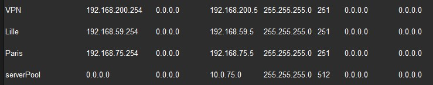

# S01E06 – Challenge : Administration Windows 🔎

## Challenge
En priorité, terminez l’atelier d’hier ! (y compris les bonus, si possible)
C’est à dire : installez Ubuntu et les logiciels demandés dessus !
Activez le copier/coller entre vos VMs et votre système hôte (petit indice : il faudra regarder du coté des « Additions Invité » de Virtual Box 😉 une petite recherche sur Internet (ou avoir écouté votre super formateur) devrait vous permettre de trouver comment faire !)
Bonus: Installer une 3ème ou 4ème VM avec le système d’exploitation Debian 13 !

---

## 📸 Partie 1 : Photo des Composants Internes (PC Fixe)

**⚠️ Avertissement de Sécurité :** Pour ceux qui ont un PC fixe, veuillez ouvrir la façade de votre ordinateur **hors tension** et **après l’avoir débranché**. Prenez une photo des composants à l’intérieur et essayez d’identifier chaque élément.

### Image de l'ordinateur

### Légende des Composants Internes

| N° | Composant | Détails / Connectique |
| :---: | :--- | :--- |
| **1** | Carte mère | Gigabyte GA-Z270X-Ultra (supporte plusieurs connecteurs) |
| **2** | Processeur (CPU) | Intel Core i7-7700K (socket z270) |
| **3** | Refroidissement (Pompe) | Watercooling Thermaltake Water 3.0 (pin alimentation carte mère) |
| **4** | Refroidissement (Radiateur) | Radiateur Watercooling (pin alimentation carte mère) |
| **5** | Stockage Principal | SSD Samsung 980 (**NVME M.2**) |
| **6** | Carte Graphique (GPU) | NVIDIA GeForce GTX 1070 (**PCI Express x16**) |
| **7** | Carte Fille | Carte fille USB (**PCI**) |
| **8** | Stockage Secondaire | SSD secondaire (**SATA**) |
| **9** | Lecteur Optique | Lecteur Blu-ray (**SATA**) |
| **10** | Refroidissement (Ventilateurs) | Ventilateurs boitiers (pin alimentation carte mère) |
| **11** | Alimentation PC | Bloc d'alimentation |
| **12** | Boitier PC | Châssis de l'ordinateur |
| **13** | Mémoire Vive (RAM) | Barrette de RAM 4x8Go DDR4 Corsair (Port parallèle carte mère) |

---

## 🔌 Partie 2 : Identification des Connecteurs Arrières

Prenez en photo les différents connecteurs présents sur votre ordinateur et cherchez le nom le plus précis possible de chaque port présent sur la machine.

### Image arrière Carte-mère

### Légende des Ports de Connexion

| N° | Nom du Connecteur | Détail / Standard |
| :---: | :--- | :--- |
| **1** | Ports PS/2 | (pour clavier et souris anciens) |
| **2** | Port USB | (Génération non spécifiée, probablement USB 3.0/3.2) |
| **3** | Port DVI | (Affichage numérique/analogique) |
| **4** | Port USB-C | (Versatile, réversible) |
| **5** | Port USB 3.1 | (Haute vitesse) |
| **6** | Port HDMI | (Interface multimédia haute définition) |
| **7** | Port USB 1.0 | (Standard ancien / Faible vitesse) |
| **8** | Port USB 2.0 | (Standard intermédiaire) |
| **9** | Port RJ45 | (Réseau Ethernet) |
| **10** | Ports Audio | (Micro, enceinte, optique) |
