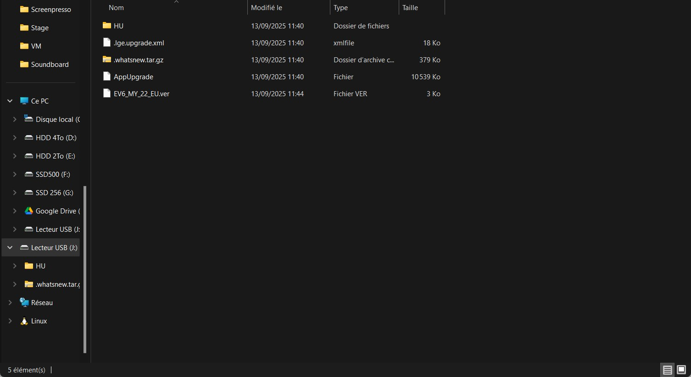
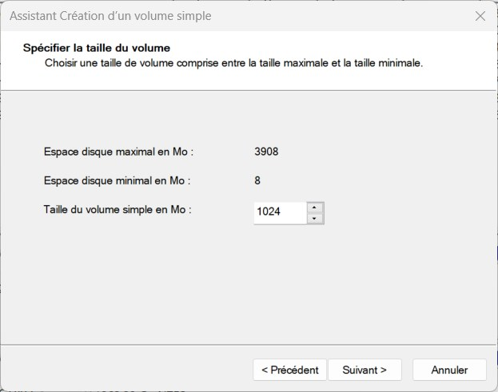

⌨️ Challenge
Accédez au BIOS de votre ordinateur, et explorez les différentes pages, sections et réglages proposés !
⚠️ Ne modifiez rien, vous risqueriez d’empêcher votre ordinateur de démarrer.
Prenez des photos des pages ou des réglages que vous ne comprenez/connaissez pas.
Pour ceux qui sont sur Mac, pas de BIOS dispo ! Vous pouvez explorer ce simulateur en ligne . ou celui-ci ou encore lui
Sauvegardez les données d’une clé USB, puis tentez de :
convertir sa table de partitions de MBR à GPT (ou l’inverse) à l’aide de l’utilitaire DiskPart (depuis une VM Windows, si vous êtes sous MacOS)
créer plusieurs partitions sur cette clé et tester de les formater avec différents systèmes de fichiers : NTFS, FAT32 et ExFAT
testez la compatibilité avec les différents systèmes d’exploitation (en connectant la clé USB sur des VMs VirtualBox)

## 1. Utilisation d'une clé USB de 64 Go

Pour ce premier test j'utilise une clé d'une capacité totale de 64 Go

Les propriétés indiquent un Formatage en ExFAT

Je formate la clé en NTFS via l'interface graphique :

## 2. Conversion d'un volume NTFS en FAT32 via Diskpart

Diskpart m'affiche un message d'erreur : le volume est trop grand

## 3. Utilisation d'une clé USB de 4Go

Pour contourner les limations dû aux formats 16 bits, j'utilise une clé USB de 4 Go

Via Diskpart, je transforme la partition MBR en GPT

 

Puis je créé différents volumes via l'interface graphique

Et pour terminer, je créé un volume logique en FAT

 

 

 

 

 

Résultat final :

