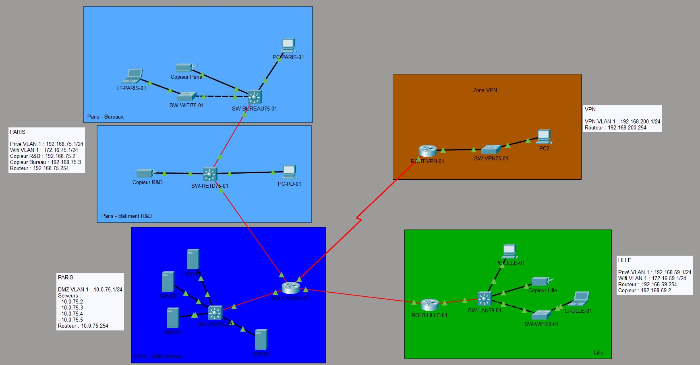

# S03 : Atelier Packet Tracer

Premier atelier de cette S03 !

🍔 Au menu :

* adressage IPv4
* configuration de switchs Cisco
* configuration de routeurs Cisco
* routes statiques
* DHCP

---

## Contexte

Une nouvelle entreprise vous recrute pour professionnaliser son réseau. Actuellement, les salariés sont connectés en WiFi sur des box FAI avec du matériel hétérogène.

Le parc informatique va être complètement renouvelé.

L'entreprise est en pleine expansion, et recrute fréquemment de nouveaux salariés. Actuellement, il y a 59 collaborateurs, vous y compris, mais l'entreprise pourrait dépasser 200 salariés ou plus dans les mois/années à venir ! 📈

Voici les différents services de l'entreprise ainsi que le nombre de salariés par service :

* commerciaux : 16
* communication : 5
* comptabilité : 5
* direction : 4
* ressources humaines : 2
* juridique : 2
* recherche et développement : 23
* informatique : 2

L'entreprise a des bureaux à Paris et à Lille, mais ils envisagent à terme d'ouvrir un site par département Français.

À Paris, on retrouve la direction, la comptabilité, le service juridique, la communication et les ressources humaines. Il y a également 10 commerciaux, 12 ingénieurs R&D et un informaticien.

Le site de Lille compte 11 ingénieurs R&D, 6 commerciaux et un informaticien.

Sur le site de Paris, une salle serveur va être créée et équipée 4 serveurs. Le coeur du réseau y sera installé. Les salariés du service R&D sont dans un batiment différent, équipé d'une petite baie informatique, de quoi y installer un peu de matériel réseau ! La baie du batiment R&D sera relié à la salle serveur avec une fibre optique.

Les salariés peuvent travailler de façon nomade : depuis leur domicile en télétravail ou en déplacement chez des clients pour les commerciaux, par exemple. Ils se connectent via un VPN sur le routeur du site de Paris au réseau de l'entreprise (plus d'infos ci-dessous).

---

## Étape 1 - Plan d'adressage

Proposez un plan d'adressage pour le réseau de l'entreprise.

Voici les sous-réseaux minimum à créer :

**Paris :**
* LAN (tous les PC fixes et portables)
* DMZ (zone démilitarisée, pour les serveurs, voir ci-dessous)
* WiFi public (pour les visiteurs, filaire obligatoire pour les salariés)

**Lille :**
* LAN (tous les PC fixes et portables)
* WiFi public (pour les visiteurs, filaire obligatoire pour les salariés)

**VPN** (un sous-réseau dans lequel se trouvent les machines des collaborateurs à distance)

Pour chacun des sous-réseaux ci-dessus, vous devez choisir une plage d'adresses IP permettant d'accueillir suffisamment de machines pour les besoins actuels et futurs de l'entreprise. Présentez la plage d'adresses IP du sous-réseau avec la notation CIDR, exemple : `192.168.42.0/24`.

Commencez également à réfléchir à l'adresse de la passerelle (du routeur) dans chaque sous-réseau. Les switchs ne seront pas dans un sous-réseau indépendant, mais on en reparle plus tard, vous pouvez les ignorer pour l'instant.

### Réponse :

* Réseau privé Paris : `192.168.75.0/24`
* Réseau public Paris : `172.16.75.0/24`
* Réseau serveur Paris : `10.0.75.0/24`
* Réseau Lille : `192.168.59.0/24`
* Réseau public Lille : `172.16.59.0/24`
* Réseau serveur Lille : `10.0.59.0/24`
* VPN : `192.168.200.0/23`

---

## Étape 2 - Câblage

L'informaticien déjà présent dans l'entreprise a travaillé avec un cabinet de conseil sur demande de la direction, et du matériel réseau a déjà été acheté en suivant les recommandations des consultants.

Pas le choix, il falloir l'utiliser ce matériel !

Voici la liste du matériel réseau à votre disposition :

**Routeurs :**
* 2x Cisco 2901 (un pour Paris, un pour Lille)
* 1x Cisco 1941 (pour le VPN)

**Modules et cartes d'extension pour routeurs :**
* 5x cartes HWIC-1GE-SFP, avec 5x modules SFP GLC-LH-SMD
* 2x cartes HWIC-2T

**Switchs :**
* 4x Cisco 3650-24PS (2 pour le LAN de Paris, un pour la DMZ, un pour le LAN de Lille)
* 3x Cisco 2960-24TT (1 pour le WiFi de Paris, un pour le WiFi de Lille, un pour le VPN)

**Modules et cartes d'extension pour switchs :**
* 4x alimentations AC-POWER-SUPPLY (une par switch 3650-24PS)
* 5x modules SFP GLC-LH-SMD

**Autres équipements :**
* 4x Serveurs
* 3x Copieurs (2 pour Paris dont un pour le batiment R&D, un pour Lille)

Pour le WiFi, on s'embête pas : on connectera directement les machines sur le switch 2960-24TT en filaire.

Le cabinet de conseil a recommandé à la direction de connecter les switchs et les routeurs en fibre optique, dès que c'était possible, d'où ce choix de matériel. Depuis, la direction ne jure plus que par la fibre ... Pas le choix, il faut donc relier le maximum d'équipements possibles en fibre optique.

Le routeur 1941 utilisé pour le VPN doit être relié au routeur 2901 du site du Paris avec une liaison Serial DTE, c'est à ça que servent les cartes HWIC-2T ! Pas de panique, ça fonctionne comme un câble ethernet ou une fibre optique classique.

### Réponse :



---

## Étape 3 - Configuration des switchs

Sur chaque switch, vous allez devoir :
* configurer le hostname
* ajouter un mot de passe pour protéger le mode privilégié (utilisez le même partout)
* configurer une adresse IP sur l'interface Vlan1

L'adresse IP doit être dans le même sous-réseau que les postes connectés au switch.

Mettez une adresse IP statique sur au moins un PC par sous-réseau pour pouvoir pinger le switch.

### Réponse :

```
enable
conf t
hostname "nom du switch"
enable secret rockroll
```

## Étape 4 - Configuration initiale des routeurs

Sur chaque routeur, vous allez devoir :

*   configurer le hostname
    
*   ajouter un mot de passe pour protéger le mode privilégié (utilisez le même partout)
    
*   configurer une adresse IP sur chaque interface du routeur connectée à un de nos sous-réseaux
    

Pour la connexion entre Paris et Lille, utilisez les adresses IP :

*   `92.12.34.1/24` pour le routeur de Paris
    
*   `92.12.34.2/24` pour le routeur de Lille
    

Pour la connexion entre Paris et le VPN, utilisez les adresses IP :

*   `92.56.78.1/24` pour le routeur de Paris
    
*   `92.56.78.2/24` pour le routeur du VPN
    

### Réponse :

```
    enable
    conf t
    hostname "nom du routeur"
    enable secret rockroll
    
    Exemple de config IP :
    ROUT-PARIS-01(config)#interface GigabitEthernet0/1/0
    ROUT-PARIS-01(config-if)#ip address 10.0.75.254 255.255.255.0
    ROUT-PARIS-01(config-if)#no shutdown
```

* * *

## Étape 5 - Routes statiques

Ajoutez des routes statiques et/ou des routes par défaut sur les routeurs de Lille, Paris et du VPN.

L'objectif ? Faire fonctionner le ping entre tous les sous-réseaux !

### Réponse :

```
    Exemple sur le routeur de Paris :
    ROUT-PARIS-01(config)#interface GigabitEthernet0/1/0
    ROUT-PARIS-01(config-if)#ip address 10.0.75.254 255.255.255.0
    ROUT-PARIS-01(config-if)#ip address 10.0.75.254 255.255.255.0
```

* * *

## Étape 6 - DHCP

Les salariés sont amenés à se déplacer, pour se faciliter la vie on va donc configurer DHCP sur l'ensemble des réseaux.

Modifiez la configuration des routeurs pour activer DHCP !

Les serveurs et copieurs doivent avoir des adresses IP statiques.

### Réponse :

```

    Exemple DHCP Paris :
    ip dhcp excluded-address 192.168.75.1 192.168.75.4 (on exclu les adresses des équipements réseaux)
    ip dhcp pool Paris
     network 192.168.75.0 255.255.255.0
     default-router 192.168.75.254
```

* * *

## Bonus

Déjà fini ? Si vous avez encore du temps et de l'énergie, vous pouvez essayez de remplacer les switchs 2960 utilisés pour le WiFi par des point d'accès WiFi !

Utilisez l'équipement AP-PT (Access Point) dans Packet Tracer, dans la catégorie Network devices > Wireless.

### Réponse :

* * *

## Méga bonus

Envie d'aller plus loin ?

Devoir configuer DHCP sur chaque routeur est un peu galère, ce serait bien qu'on puisse tout configurer sur un serveur central (dans la DMZ, par exemple), avec plusieurs pools pour chaque sous-réseau ! Problème, les trames DHCP sont en broadcast, et ne traversent donc pas les routeurs...

Il faudrait trouver un moyen de relayer les trames DHCP vers notre serveur 🤔

### Réponse :

Activation du DHCP sur un serveur

Suppression du DHCP sur les routeurs et activation du relais DHCP sur les routeurs

```
    Exemple : 
    interface GigabitEthernet0/0/0
      ip helper-address 192.168.75.254
     no shutdown
    exit

```

Activation des relais DHCP sur tous les switchs :

```
    ip dhcp relay information trust-all
```

Le serveur désigné attribue des IP selon le réseau (routeur) qui émet la demande.
